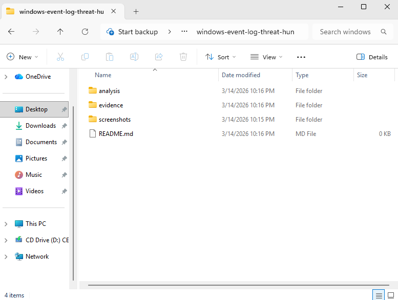
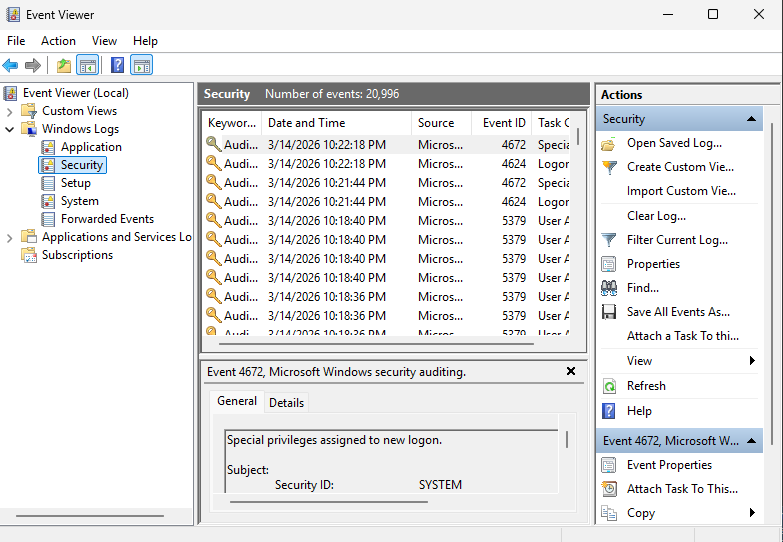
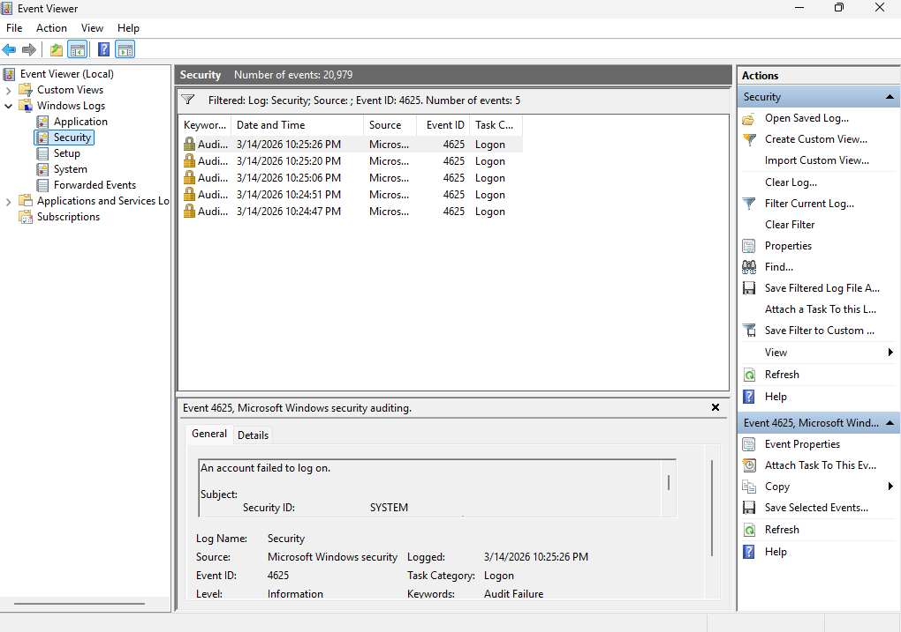
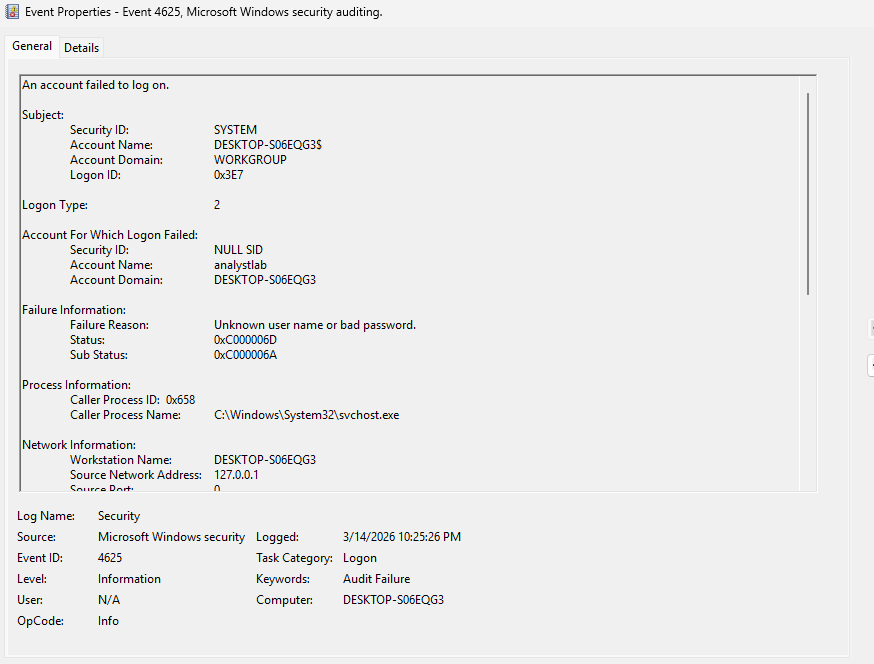
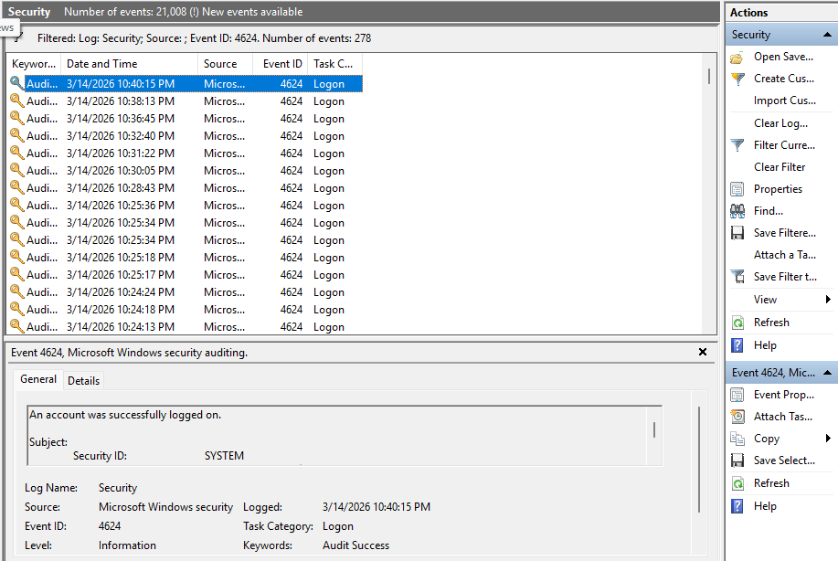
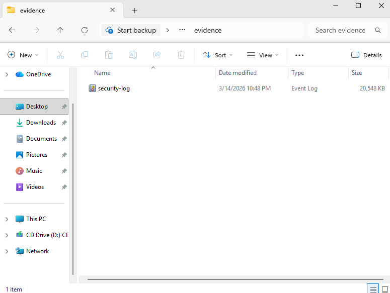
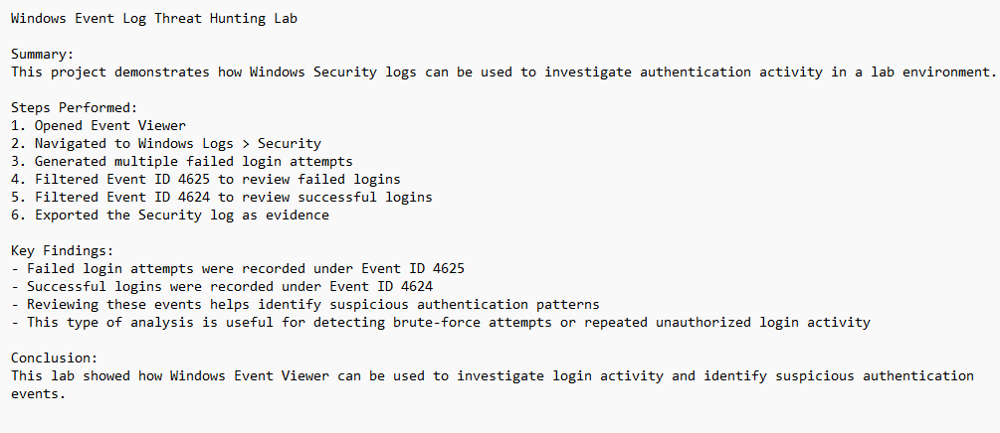

# Windows Event Log Threat Hunting Lab

## Overview

This project demonstrates how a security analyst can investigate authentication activity using **Windows Security Event Logs**.

Windows logs contain valuable forensic information that helps analysts detect suspicious behavior such as failed login attempts, brute-force activity, and unauthorized access attempts.

In this lab environment, multiple failed login attempts were intentionally generated to simulate suspicious authentication activity. These events were analyzed using **Event Viewer** to identify both failed and successful logon events.

---

## Lab Environment

* **Operating System:** Windows 11 (Virtual Machine)
* **Hypervisor:** VirtualBox
* **Tool Used:** Event Viewer
* **Log Source:** Windows Security Logs

---

## Project Folder Structure

The project was organized to store screenshots, investigation evidence, and analysis documentation.

---

## Step 1 – Access Windows Security Logs

Event Viewer was used to review authentication activity recorded in Windows Security logs.

Navigation path used:

Event Viewer → Windows Logs → Security

---

## Step 2 – Identify Failed Login Attempts

Event Viewer was filtered for **Event ID 4625**, which represents failed authentication attempts.

Multiple failed login attempts were generated in order to simulate suspicious login activity.

---

## Step 3 – Investigate Event Details

One of the failed login events was opened to review the detailed information available in the event log.

Important fields analyzed included:

* Account Name
* Logon Type
* Event ID
* Timestamp

---

## Step 4 – Review Successful Logins

Event Viewer was then filtered for **Event ID 4624**, which represents successful authentication events.

This helps analysts determine whether successful access occurred after multiple failed login attempts.

---

## Step 5 – Export Security Logs as Evidence

The Windows Security log was exported as an **EVTX file** to preserve forensic evidence for further analysis.

---

## Step 6 – Document Investigation Findings

Investigation notes were written to summarize the authentication activity observed in the system.

---

## Key Findings

* Multiple failed login attempts were detected
* Failed authentication events were recorded under **Event ID 4625**
* Successful authentication events were recorded under **Event ID 4624**
* Windows Security logs provide valuable insight into authentication activity

---

## Skills Demonstrated

* Security log analysis
* Threat hunting techniques
* Authentication event investigation
* Evidence collection
* Security documentation

---

## Conclusion

Windows Security Event Logs provide critical visibility into authentication activity across systems.

By monitoring failed and successful login events, security analysts can quickly identify suspicious login behavior and respond to potential security incidents.
---

## Author

Bryan Ortega  
Cybersecurity Student | Aspiring Security Analyst  
GitHub: https://github.com/BryanOrt-infosec
